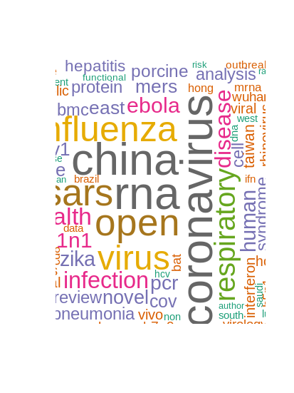
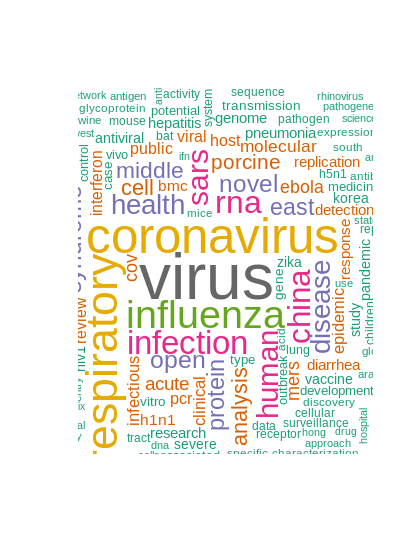
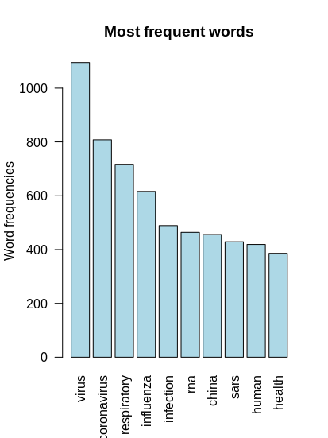

# POS Tagging Wordclouds with R

Snippet to do Wordclouds of POS (Part-of-Speech) Tagging with R

This code was used to produce some of the best wordclouds I've seen so far, about the Covid-19 crisis. The text variable was extracted from 13202 Scientific Papers taken from Kaggle and Covid-19 text analysis contest and challenge.

Some examples of Wordclouds/Plots produced with this code are:

